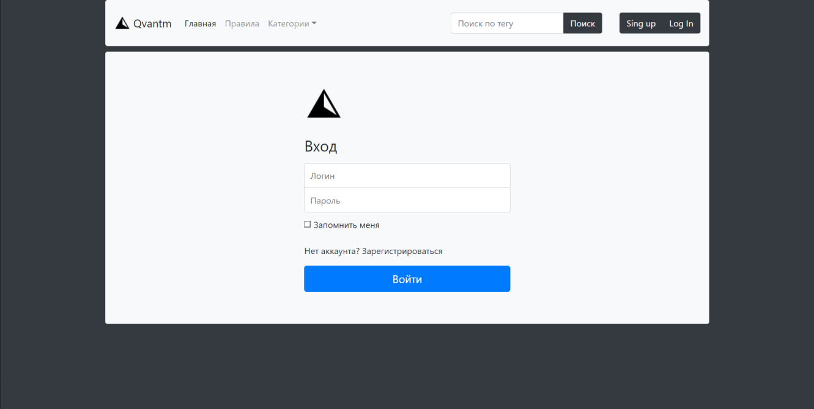
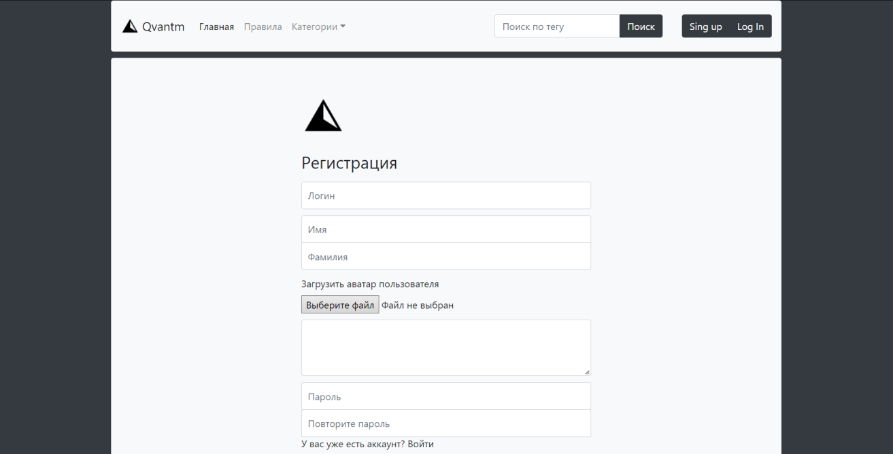
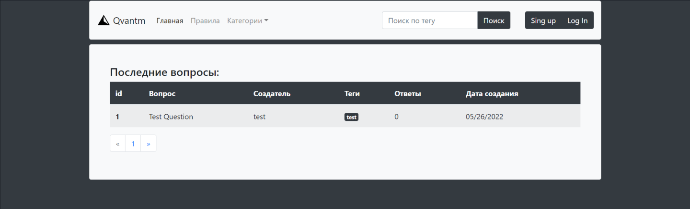

<div id="top"></div>


<!-- PROJECT LOGO -->
<br />
<div align="center">
  <a href="https://github.com/dmitrii1011sg/forum_flask.git">
    
  </a>

<h3 align="center">Форум</h3>

  <p align="center">
    Простой форум на flask
    <br />
    <a href="https://github.com/dmitrii1011sg/forum_flask"><strong>Репозиторий проекта »</strong></a>
    <br />
    <br />
  </p>
</div>


<!-- TABLE OF CONTENTS -->
<details>
  <summary>Содержание</summary>
  <ol>
    <li>
      <a href="#about-the-project">О проекте</a>
      <ul>
        <li><a href="#built-with">Что использовалось при создании проекта</a></li>
      </ul>
    </li>
    <li>
      <a href="#getting-started">Начало работы</a>
      <ul>
        <li><a href="#installation">Установка</a></li>
      </ul>
    </li>
    <li><a href="#contact">Контакты</a></li>
  </ol>
</details>


<!-- ABOUT THE PROJECT -->
## О проекте




Форум сделанный на flask со всеми основными функциями (вход в аккаунт, регистрация, создание вопросов и ответов и т.д).

<p align="right">(<a href="#top">Наверх</a>)</p>


### Что использовалось при создании проекта 

* [flask](https://pypi.org/project/Flask/)
* [Flask-WTF](https://pypi.org/project/Flask-WTF/)
* [SQLAlchemist](https://pypi.org/project/SQLAlchemy/)
* [Bootstrap](https://getbootstrap.com)

<p align="right">(<a href="#top">Наверх</a>)</p>


<!-- GETTING STARTED -->
## Начало работы

Что бы запустить сайты выполните следующие простые шаги.

### Установка

1. Клонируйте репозиторий
   ```sh
   git clone https://github.com/dmitrii1011sg/forum_flask.git
   ```
2. Установите все библиотеки
   ```sh
   pip install -r requirements.txt
   ```


<p align="right">(<a href="#top">Наверх</a>)</p>


<!-- CONTACT -->
## Contact

Дмитрий Горшков - [@telegram_handle](https://t.me/dmitrii1011) - dmitrii1011sg@gmail.com

Ссылка на проект: [https://github.com/dmitrii1011sg/forum_flask](https://github.com/dmitrii1011sg/forum_flask)

<p align="right">(<a href="#top">Наверх</a>)</p>


<!-- MARKDOWN LINKS & IMAGES -->
<!-- https://www.markdownguide.org/basic-syntax/#reference-style-links -->
[product-screenshot1]: image_for_readme/1.png
[product-screenshot2]: image_for_readme/2.png
[product-screenshot3]: image_for_readme/3.png
